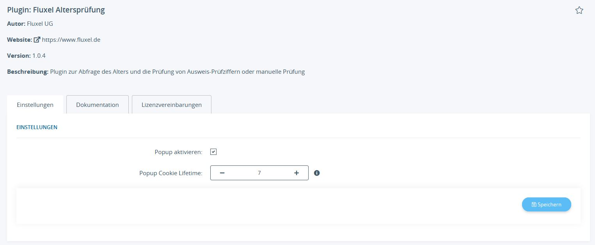
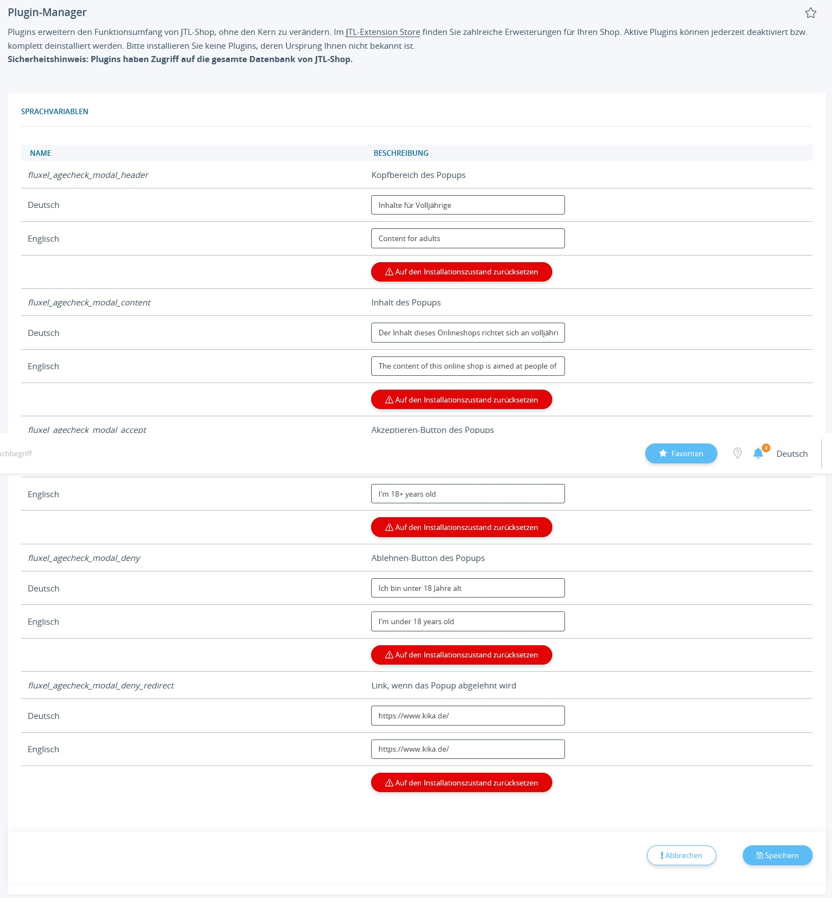

# Altersprüfung von Fluxel für JTL-Shop 5+

[Download](https://github.com/fluxel-app/fluxel_alterspruefung/releases/download/v1.0.4/fluxel_alterspruefung.zip)

[Blogeintrag und Infos](https://www.fluxel.de/2021/07/29/fluxel-open-source-jtl-shop-plugins/)

Kompatibilität: JTL-Shop 5 oder höher

Diese Plugin zeigt ein Popup bei dem Besuch des Shops an und fragt den Nutzer nach seiner Volljährigkeit.

## Einstellungen

In den Einstellungen des Plugins aktivieren Sie das Popup und legen fest, wie lange der Cookie gültig bleibt, welcher das Akzeptieren vermerkt. Sollte der Benutzer die Zeit in Tage den Shop nicht besuchen, muss er erneut das Popup akzeptieren.

## Sprachvariablen

Alle sprachspezifischen Informationen werden in Sprachvariablen gespeichert, so auch der Link auf den weitergeleitet wird, sollte der Benutzer das Popup ablehnen.

